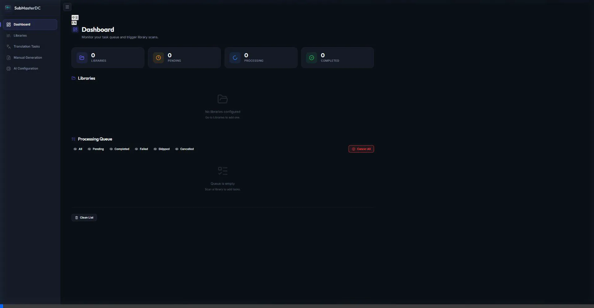

# SubMasterDC
### NAS 智能字幕管家

许可协议: [AGPL-3.0](LICENSE)

SubMasterDC 是一款基于 Whisper 和大型语言模型 (LLM) 的全自动视频字幕提取与翻译工具，专为 NAS 设备（Synology、QNAP、Unraid）通过 Docker 部署而优化设计。

---

## 声明与归属
本项目是一个基于 [aexachao/nas-submaster](https://github.com/aexachao/nas-submaster) 原创工作的分支 (Fork)。

SubMasterDC 是在人工智能辅助下开发的个人业余项目。本项目不处于活跃开发状态，仅用于关键修复和个人维护。

根据原项目要求，本项目遵循 GNU Affero General Public License v3.0 (AGPL-3.0) 协议开源。

---

## 界面展示 (UI Showcase)

*干净状态下的控制面板、媒体库设置和 AI 配置页面导览。*

---

## 核心特性
- **智能语言检测**：在视频的多个时间点（起始、5分钟、10分钟）评估音频，以确认真实语言，避免因音乐片头导致 Whisper 识别错误。
- **内嵌字幕提取**：自动检测并优先提取视频已有的内嵌字幕轨，显著加快处理速度并减少 AI API 调用消耗。
- **大预言模型翻译**：深度集成 Ollama (本地部署)、DeepSeek、OpenAI 和 Gemini。
- **媒体库管理**：支持选择性扫描 NAS 文件夹，并支持监听文件变动 (Watchdog) 自动处理。
- **处理队列**：包含现代化控制面板，可按状态（等待中、处理中、已完成、失败、已取消）过滤和监控任务。
- **手动生成**：可无视媒体库规则，直接手动上传或选择指定文件强制生成字幕。
- **双语支持**：可选生成包含双语的字幕文件 (.srt 或 .ass)。

---

## 部署指南 (Docker)

### 1. 文件结构
在您的 NAS 上创建以下结构：
```text
/volume1/docker/submasterdc/
├── data/           # 配置与数据库
├── models/         # Whisper 模型
└── docker-compose.yml
```

### 2. 配置文件
建议的 `docker-compose.yml` 示例配置：

```yaml
version: '3.8'

services:
  submasterdc:
    image: [USER]/submasterdc:v0.1
    container_name: submasterdc
    restart: unless-stopped
    ports:
      - "8000:8000"
    volumes:
      - ./data:/app/data
      - ./models:/app/data/models
      - /your/media/path:/media
    environment:
      - PUID=1026    # NAS 用户 ID
      - PGID=100     # NAS 用户组 ID
      - TZ=Asia/Shanghai
```

### 3. 运行服务
在终端中执行：
```bash
docker-compose up -d
```

---

## 快速使用指南

### 初始化设置
1. 在浏览器访问 `http://[NAS-IP]:8000`。
2. 进入 **AI Configuration** (AI 配置) 页面，设置您的 LLM 服务商和 Whisper 模型大小。
3. 对于没有独立显卡的设备 (如 N100 处理器)，建议使用 `base` 模型以获得最佳性能。

### 媒体库设置
在 **Libraries** (媒体库) 选项卡中添加您的媒体文件夹。系统提供两种扫描模式：
- **Automatic (自动模式)**: 使用文件系统监控 (Watchdog) 在新文件添加进文件夹的瞬间捕获它，并自动将其送入队列。非常适合与 Sonarr/Radarr 等软件搭配使用。
- **Periodic (周期模式)**: 按照设定的时间间隔 (如每24小时) 定期全盘扫描，找出缺失字幕的文件。适合极少变动的长期静态库。
- **Manual (手动模式)**: 关闭任何后台自动处理。您必须在控制面板 (Dashboard) 手动点击扫描按钮以检测新文件。

### 翻译与 API 限制
在 **AI Configuration** (AI 配置) 页面配置正确的 API 凭证。您可以设置每批翻译的字符数。较小的批次有助于降低大语言模型 (LLM) 出现“幻觉”或漏翻的概率，但会消耗更多的 API 请求限制。
> **API 限制说明**: 如果未正确配置翻译 API (或额度已耗尽)，程序仍能正常运行，但仅限以下基础功能：
> 1. 如果视频同时内嵌了所选的两种目标语言字幕轨，程序能将它们提取并合并生成一份双语字幕。
> 2. 程序会将音频的*原始语言*识别并原封不动地导出（例如，将英文对话生成一段纯英文字幕）。
> 3. 由于无法连接到大模型，任何跨语种的翻译任务（例如：英译简中）都会跳过。

### 字幕生成逻辑
1. **扫描文件**：识别缺少外部字幕的视频文件。
2. **提取内嵌**：尝试提取视频自带的内嵌字幕作为翻译源，从而节省时间和算力。
3. **多点投票**：如果没有内嵌字幕，系统会在音频的不同时间点采样，以确保语言检测准确。
4. **语音识别**：使用 Faster-Whisper 将语音转录为文字（在未找到内嵌源时）。
5. **AI 翻译**：使用选定的大语言模型翻译源文本，生成自然流畅的字幕。

## 鸣谢
核心代码基于 [aexachao/nas-submaster](https://github.com/aexachao/nas-submaster)。借助 AI 辅助开发的个人业余项目。
